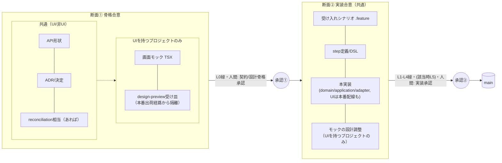

# ADR-0022: パイプラインのコミット/マージを「骨格合意」と「実装合意」の2断面に正式化する

> **承認者向けサマリ**: 1スライスの成果物をmainにコミット/マージしてよいタイミングを、2箇所に固定する。
> 1つ目は「契約の形（＋UIを持つプロジェクトでは画面デザインも）に人間が合意した時点」（断面①・骨格
> 合意。既存の「設計骨格」承認点に相乗り）。2つ目は「動く・テスト済みの機能に人間が合意した時点」
> （断面②・実装合意）。この境目は恣意的な区切りではなく、受け入れシナリオ（`.feature`）だけがCI上で
> 実装と強く結びついている（定義すると実装まで要求される）という技術的事実から自然に落ちる場所であり、
> 新しい承認段階を作るものではない。断面①の中身はプロジェクト種別（UIの有無）で変わる——UIを持つ
> プロジェクトのみ画面モック・design-preview受け皿を伴う。あわせて、画面設計の受け皿（design-preview）
> を本番実装から隔離する原則（UIを持つプロジェクトにのみ関係する）を、developer宿題だった位置づけから
> 正式な原則へ格上げする。

## 文脈

人間がパイプラインのコミット/マージ境界を正式化することを決定した（人間確定・再検討不要。
meta/adr/0011「orchestratorのディスパッチはroutingに限り実質的内容を注入しない」の精神通り、
この決定はorchestratorが人間からそのまま運んだものであり、architectは決定内容そのものを再導出・
再検討しない。本ADRは、その決定を成文化し既存規程との整合を取ることに徹する）。

### 断面がこの位置に落ちる理由——CIの結合構造

受け入れシナリオ（`.feature`）は、CI上で他のどの成果物にも無い**二重の結合**を持つ。

- **govlint**（統治文書の機械検証。meta/README.mdが「CIのL0で実行」と位置づける、
  verification.mdのL1〜L5とは別の最下段）は、API仕様等が参照するシナリオIDが、どこかの`.feature`に
  **定義済み**であることを要求する（`meta/tools/govlint.py` `check_scenario_ids`）
- **verification.md L4**は、`.feature`に定義されたシナリオが、step定義＋実装を伴って初めて緑になる
  ことを要求する（「シナリオの実行」が確定手段）

この2つの結合により、`.feature`は「参照されればL0を要求し、定義されればL4（実装）まで引きずる」という
性質を持つ唯一の成果物になる。これはprojects/reservation-system/friction-log.md **FR-014**
（cause_key: `scenario-id-couples-l0-and-l4`）が指摘した構造である（本ADR起草時点でFR-014を含む
PRは未マージだが、内容は人間から要約提供されており、参照する）。

一方、それ以外の成果物はそれぞれ単独で緑になれる:
- **API形状**（`api.yaml`のパス/スキーマ）: L0のスキーマlint止まり。実装が無くても形状の定義だけで
  緑になる（L3の契約テストは実装段階の話であり、形状の合意そのものは実装の存在を要求しない）
- **ADR（決定）**: 本文はprose。CIの対象はfrontmatterの妥当性検証（L0）のみ
- **reconciliation**: CI対象外の散文
- **画面モック（TSX）・design-preview受け皿**: 型検査は受けるが、L1〜L4の実行対象ではない
  （projects/reservation-frontend/adr/0004 §1条件3「検証パイプラインに乗らない」）

したがって、パイプラインの自然な断層は「決定・設計」（単独で緑になれる）と「シナリオ・実装」
（L4という機械実行を通らないと緑になれない）の間に落ちる。

### 参照

meta/adr/0017（並行モデル・「設計骨格」承認点の新設）、meta/adr/0018（designer=design integrator）、
meta/adr/0020（伝送方式・成果物形式）、meta/adr/0021（(b)実行主体の明確化・骨格凍結による改修
ガバナンス。design-preview出荷経路除外を developer 宿題として計上し、本ADRへの宿題として持ち越した）。

## 決定

### 1. パイプラインのコミット/マージは「2断面」で行う

**断面① 骨格合意（skeleton agreement）——中身はプロジェクト種別（UIの有無）で変わる**

designerフロー・画面モック・design-preview受け皿は「**UIを持つプロジェクトのみ登場する**」という
既存規定（meta/agents.md 2節の役割分担表）に従う。したがって断面①に入る成果物は、プロジェクト種別で
次のように分かれる。

- **UIを持つプロジェクト（例: reservation-frontend）の断面①**:
  - 入る成果物: 契約（フロントが依存するAPI形状）＋ADR（決定）＋reconciliation＋**画面モック
    （TSX）＋design-preview受け皿**
  - ゲート: L0（govlint）緑。フロントの受け皿で画面が描画でき、人間がレビューできる状態
  - 承認: **契約の形＋画面デザイン**への人間合意
- **バックエンド/非UIプロジェクト（例: reservation-system）の断面①**:
  - 入る成果物: **API契約形状（`api.yaml`のパス/スキーマ）＋ADR（決定）＋（あれば）reconciliation
    相当のdecision系資料のみ**。画面が存在しないため、**画面モック・design-preview受け皿は無い**
    （欠落ではなく、非UIプロジェクトの断面①の定義そのもの）
  - ゲート: L0（govlint）緑
  - 承認: **API契約の形**への人間合意
- いずれの種別でも、受け入れシナリオの**意図**はADR・reconciliation（相当資料）の散文で持つ。実行
  可能な`.feature`は断面②に持ち越す（下記の共通CI結合構造ゆえ）

**断面② 実装合意（implementation agreement）——プロジェクト種別によらず共通**

- 入る成果物: 受け入れシナリオ（`.feature`）、step定義、テストDSL、本実装（domain/application/
  adapter、UIプロジェクトではフロントの本番配線も）、モックの設計調整（UIプロジェクトのみ。骨格内の
  洗練。例: reservation-frontend/adr/0006が要求する予約者名表示の除去等）
- ゲート: L1〜L4緑（UIプロジェクトかつ対象があればL5 VRTも）
- 承認: **動く・テスト済みの機能への人間合意**。既存の実装承認点・step実装承認点（permissions.md）
- **scenario-first TDD（赤いシナリオを先に書き→緑にする）は、この断面②の内部で回る**。赤いシナリオ
  や未完の実装をmainにコミットしない。各コミットはそれ自身の粒度で自己完結・緑を保つ。スライス全体の
  未完了はactiveContext.mdが追跡する（P-11: 「現在」はactiveContextだけが持つ）。受け入れシナリオと
  実装のハード結合（FR-014）はプロジェクト種別によらず共通であるため、断面②の構成もUI/非UIで分かれない

### 2. design-preview（受け皿）は本実装から architecturally 隔離する（UIを持つプロジェクトにのみ関係）

design-previewは本番実装（出荷コード）から architecturally 隔離される。**本番ビルド・配信ルートに
含めない**。meta/adr/0021がdeveloper宿題として挙げた「`src/design-preview/`の出荷経路除外の保証」を、
本ADRで**原則に格上げする**——この除外は任意の実装上の配慮ではなく、断面①・断面②の分離そのものが
要求する構造である。**design-preview自体がUIを持つプロジェクトにしか存在しないため、この隔離原則も
当然UIを持つプロジェクトにのみ関係する**（非UIプロジェクトには受け皿という概念そのものが無い）。

断面①に入る受け皿は「査読インフラ」であり、断面②の本実装とは物理的/ビルド上で分かれる（**受け皿≠
本実装**）。具体的な除外機構（別entry・ビルド設定での除外・import境界lint等）は、これまで通り
**developer宿題**とする（meta/adr/0014: ロジックを持つ検証インフラはdeveloperの領分、テスト付きで
実装する）。本ADRは原則のみを定め、実現手段は規定しない。

### 3. 既存承認点との関係（発明でなく整理）

2断面は、既存の「設計骨格」承認（meta/adr/0017）と実装承認に素直に重なる。本ADRは**新しい承認段階を
作るのではなく、どの承認点でどの成果物をコミット/マージしてよいかを明文化するもの**である。
permissions.mdの「人間の承認ポイント」表（契約／設計骨格／step実装／信条規程の4接点）はそのまま維持
し、本ADRはこの4接点に「いつ何がmainに載ってよいか」という時間軸を足すにとどめる。

## 成果物→断面の対応表

| 成果物 | 対象プロジェクト種別 | 断面 | ゲート | 承認 |
|---|---|---|---|---|
| API形状（`api.yaml`のパス/スキーマ） | 共通（UI/非UI） | ① 骨格合意 | L0緑 | 契約／設計骨格承認（人間） |
| ADR（決定） | 共通 | ① 骨格合意 | L0緑（frontmatter検証） | 契約／設計骨格承認に付随 |
| reconciliation（相当のdecision系資料） | 共通（非UIでは有れば） | ① 骨格合意 | CI対象外 | 設計骨格承認に随伴する参考資料 |
| 画面モック（TSX） | **UIを持つプロジェクトのみ** | ① 骨格合意 | 型検査のみ（L1〜L4対象外） | 設計骨格承認（人間・画面デザイン） |
| design-preview受け皿 | **UIを持つプロジェクトのみ** | ① 骨格合意 | 同上。本番ビルド・配信ルートから隔離（本ADRの原則） | 同上 |
| 受け入れシナリオ（`.feature`） | 共通 | ② 実装合意 | L0緑＋L4（定義済シナリオは実装必須） | 実装／step実装承認（人間） |
| step定義・テストDSL | 共通 | ② 実装合意 | L4 | step実装承認（人間、対訳表経由） |
| 本実装（domain/application/adapter、UIプロジェクトでは本番配線も） | 共通 | ② 実装合意 | L1〜L3緑（該当すればL5 VRT） | 実装承認（人間） |
| モックの設計調整（骨格内の洗練） | **UIを持つプロジェクトのみ** | ② 実装合意 | 型検査・該当あればL1〜L4 | 実装承認に含める |

## 簡易フロー

承認②の内部でscenario-first TDDの赤→緑が回る。赤いシナリオ・未完の実装はmainにコミットしない
（各コミットは自己完結・緑。全体の未完了はactiveContext.mdが追跡する）。

## 検討した代替案

- 案A: 1断面のまま（現状運用）とし、成果物の粒度でPRを個別に分割する運用を都度判断する / 不採用:
  「なぜここで区切るか」が構造化されておらず、次のスライスでも毎回同じ判断をやり直すことになる。
  FR-014が示すCI結合構造という機械的根拠がある以上、断面をルールとして固定した方が実務コストが下がる
- 案B: 3断面以上に細分化する（例: 契約単独／モック単独／実装単独） / 不採用: 人間が明示的に決定した
  のは2断面（骨格・実装）であり、これを超える細分化は承認点を増やす（permissions.mdの4接点を超える
  追加コストを生む）。meta/adr/0017の「新しい5つ目の承認カテゴリは作らない」という既存決定とも整合
  しない
- 案C: design-preview隔離を「原則」ではなく「developerの実装判断に完全に委ねる」（meta/adr/0021の
  宿題のまま据え置く） / 不採用: 人間が本実装からの architectural な隔離を明示的に要望した。実現手段
  がdeveloper宿題のままでよいのは変わらないが、隔離すること自体は本ADRで原則として固定し、以後の
  実装判断のブレ（「そのうち出荷経路に混ざる」リスク）を防ぐ
- 案D: 断面①を全プロジェクト共通の単一定義（API形状＋ADR＋reconciliation＋画面モック＋design-preview
  受け皿）のまま書く / 不採用: designer・画面モック・design-preview受け皿は「UIを持つプロジェクトのみ
  登場する」という既存規定（meta/agents.md）と矛盾する。非UIプロジェクト（reservation-system等）に
  存在しない成果物を断面①の必須構成であるかのように書くと、次にバックエンド専用スライスを扱う際に
  誤読を招く。プロジェクト種別で明示的に分岐させる方が正確

## 帰結

- **meta/agents.md §4（標準フロー）に、コミット/マージが断面①（骨格合意）・断面②（実装合意）の
  2箇所で行われる旨を1〜2文で追記する**。詳細な対応表・根拠は本ADRを参照させ、agents.md自体の
  簡潔さは保つ（本PR内で反映済み）
- **design-preview隔離原則の正式な記述位置は本ADR（0022）とする**（UIを持つプロジェクトにのみ
  関係する原則である旨を明記済み）。meta/adr/0021の該当宿題（実現手段の実装）はそのまま有効（本ADRは
  原則を格上げするのみで、実現手段の指定・実装は行わない）
- プロジェクト側ADR（projects/reservation-frontend/adr/0004、画面モック承認プロセス）の§1・§2
  条文改訂（未着手、静的HTML/CSS方式からTSX＋受け皿方式への書き換え）が、design-preview隔離原則を
  プロジェクト運用として具体化する場所になる。本ADRはこの改訂を代替しない
- **具体例（プロジェクト種別による断面①の違い、検証可能な事実）**: reservation-system（バックエンド、
  非UIプロジェクト）は、designer・画面モック・design-preview受け皿が一度も登場したことがない
  プロジェクトである。同プロジェクトの断面①は、常に「API契約形状＋ADR」だけで完結してきた（例:
  projects/reservation-system/adr/0006は、RSV-Aの空き枠契約の意味論——最小予約時間未満の隙間を
  空き枠に含めない——を定めた決定であり、画面もモックも伴わずに契約・実装へ進んでいる）。モックが
  無いことは欠落ではなく、非UIプロジェクトの断面①の定義そのものであることが、この実例から確認できる。
  対照的にreservation-frontend（UIを持つプロジェクト）の断面①は画面モック＋design-preview受け皿を
  伴う必要があり、これが現状PRドラフトの段階で保留中であるために断面①が未完である、という違いが
  両プロジェクトの対比から確認できる（reservation-frontendの現状適用は下記）
- **reservation-frontendへの適用（現状の帰結）**: 予約機能（BookingDesign）は、断面①の成果物の
  うち**契約形状（`contracts/availability-view.feature`が参照するAPI形状）・ADR
  （0001〜0006）・reconciliation（`design/reconciliation/booking-design-reconciliation.md`）は
  既にmainにある**が、**画面モック（`BookingDesign.tsx`）と design-preview受け皿はPRドラフトの
  段階で保留中であり、断面①が未完**である。断面①を完成させるには、design-previewの出荷経路除外
  （developer宿題、meta/adr/0020・0021由来、本ADRで原則化）を実装した上で、モック＋受け皿をmain
  に載せる必要がある。この帰結・宿題はreservation-frontend/activeContext.mdに反映する（本ADRでは
  実装しない）
- friction-log: FR-014（cause_key: `scenario-id-couples-l0-and-l4`）は本ADRのrelates_toから参照
  される。FR-014自体の`pushed_to`欄への本ADR追記は、FR-014を含むPRのマージ後、そちら側の作業として
  行う（本ADRはFR-014を含むファイルを直接編集しない。P-06相当の慎重さ——他PRの未マージ内容を本ADR
  から書き換えない）

## 確認事項（人間への差し戻し）

ADR起草の指示では、reservation-systemの具体例として「`GET /rooms`契約（`api.yaml`形状＋ADR-0007）・
受け入れシナリオ`RSV-L`が断面②へ持ち越し済みで、現に全CI緑」という例が挙げられた。しかし本ADR起草
時点のリポジトリ（main、`projects/reservation-system/`）を確認したところ、`GET /rooms`（会議室一覧）
に相当するパスは`contracts/reservation-api.yaml`に存在せず、project-scopeのADR-0007・シナリオID
`RSV-L`もいずれも見当たらなかった（`GET /rooms/{roomId}/availability`・`GET /rooms/{roomId}/rules`
という既存の個別部屋向けエンドポイントのみ存在する）。むしろreservation-frontend/activeContext.mdは
「`GET /rooms`の採否はバックエンドの新スライス候補として未定・人間の転記待ち」と記録している。

この食い違いは、(a) 未マージの別作業（本ADRから見えないブランチ/PR）が念頭にある、(b) 具体例の記憶
違い、のいずれかと考えられる。本ADRでは**断定を避け**、検証済みの事実（reservation-systemが
design-preview・画面モックを一度も伴っていないこと、既存ADR-0006が契約単独で完結する断面①の実例で
あること）を代わりの具体例として採用した。`GET /rooms`が実際に断面②まで完了している別成果があるなら、
本ADRの「具体例」段落をその実ファイル（`api.yaml`該当箇所・ADR番号・シナリオID）への正確な参照に
差し替える追補が必要になる（本ADRでは行わない。人間の確認を待つ）。
